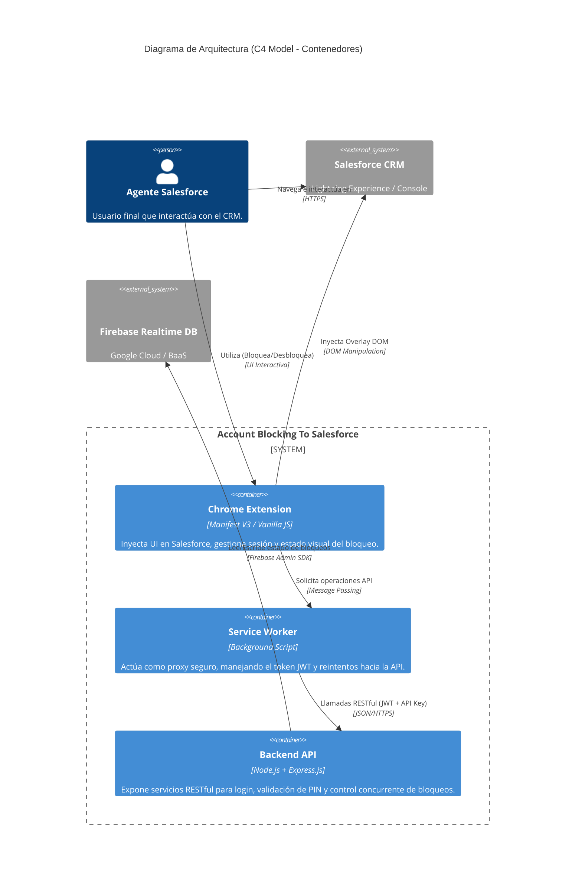

# Documentación Técnica: Account Blocking To Salesforce (v2.0)

## 1. Objetivo y Alcance de la Aplicación
**Account Blocking To Salesforce** es una solución diseñada para resolver problemas críticos de negocio relacionados con la colisión de trabajo y concurrencia de múltiples agentes dentro de entornos Salesforce. 

El objetivo principal es gestionar la **exclusividad temporal de acceso a cuentas ("clientes")**, impidiendo que dos o más operadores modifiquen, interactúen o contacten al mismo cliente de forma simultánea. Al garantizar el bloqueo de la cuenta a un único propietario por un tiempo definido, la aplicación previene la duplicidad de esfuerzos, inconsistencias en los datos y mejora significativamente la experiencia del cliente final al evitar comunicaciones redundantes.

## 2. Modelo de Arquitectura Elegida
La solución implementa una arquitectura **Cliente-Servidor** fuertemente acoplada a la interfaz nativa de Salesforce mediante inyección de scripts, con un backend centralizado para garantizar la sincronización del estado en tiempo real. 

A continuación se presenta el diagrama de arquitectura usando notación C4 Model (Nivel de Contenedores):

## 3. Pila Tecnológica (Tech Stack)
Para alinearse con las capacidades de ejecución en el navegador y los requisitos de latencia en tiempo real, se ha seleccionado el siguiente stack:

- **Lenguajes:** 
  - Vanilla JavaScript (ES6+), HTML5, CSS3 (Frontend/Extensión).
  - JavaScript / Node.js (Backend).
- **Frameworks:** 
  - **Chrome Extension API:** Manifest V3.
  - **Express.js:** Framework de enrutamiento y middleware para el Backend.
- **Mensajería y Base de Datos:** 
  - **Firebase Realtime Database:** Base de datos NoSQL alojada en la nube, optimizada para la sincronización rápida de estado y alta concurrencia.
- **Infraestructura y Cloud:** 
  - **Render:** Plataforma Cloud (PaaS) utilizada para el despliegue del servidor Node.js/Express.
  - **Google Cloud Platform (GCP):** Provisión del entorno de Firebase y autenticación (IAM).
  - **Chrome Enterprise:** Infraestructura para el despliegue de políticas organizacionales y forzado de la extensión.

## 4. Calidad, Pruebas y Despliegue (CI/CD)
El ciclo de vida del software sigue las mejores prácticas de DevOps y control de calidad:

- **Control de Versiones y Pipeline (CI):** El código fuente se gestiona bajo repositorios Git (ej. GitLab/GitHub). Los cambios en la rama `main` del Backend desencadenan un pipeline de **despliegue continuo (CD) directo en Render**, con instalación automática de dependencias (npm) e inicialización del servidor.
- **Despliegue Empresarial Forzado (Política de Instalación):** Para garantizar el uso obligatorio de la extensión y evitar que los agentes operativos puedan **eliminarla, deshabilitarla o pausarla**, la extensión debe ser instalada mediante políticas administrativas:
  - Se utiliza la directiva de Chrome Enterprise **`ExtensionInstallForcelist`** ("Forzar la instalación de aplicaciones y extensiones").
  - **Implementación:** A través de la *Google Admin Console* (asignado por OU) o vía *Windows GPO (Active Directory)* distribuyendo las plantillas ADMX. Las extensiones bajo esta política operan silenciosamente, ignoran el modo incógnito y no pueden ser alteradas por el usuario local.

## 5. Arquitectura de Seguridad
La solución incorpora controles de seguridad para proteger los flujos dentro del entorno empresarial:

- **Autenticación y Sesión:**
  - Empleo de **JSON Web Tokens (JWT)** sin caducidad por tiempo en el servidor; el ciclo de vida de la sesión se ata exclusivamente a la memoria `chrome.storage.session` del navegador, limpiándose al cerrarlo.
  - El ingreso inicial y la creación de la sesión requiere un hash seguro.
- **Criptografía:** Contraseñas y códigos PIN son almacenados en Firebase utilizando hashing con **`bcrypt`** (10 rondas de salt). El backend realiza la validación criptográfica aislando el PIN de la red.
- **Protección de Red y API:**
  - Capa de **API Key Estática (`X-API-Key`)** para bloquear peticiones que no provengan de la extensión.
  - **Rate Limiting** para prevenir fuerza bruta en autenticación (10 intentos / 15 min) y abuso general.
  - Políticas estrictas de **CORS** y cabeceras **Helmet**.

## 6. Lógica de Negocio y Reglas Operativas
- **Exclusividad Absoluta:** Un bloqueo activo muestra un *overlay* irrompible (Z-Index alto) para cualquier agente ajeno, impidiendo el uso de la interfaz de Salesforce en dicho registro.
- **Liberación Controlada:** Solo el agente creador del bloqueo puede liberar la cuenta de forma anticipada. Requiere la validación Server-Side de su PIN secreto de 4 a 6 dígitos.
- **Acceso Temporal de Emergencia:** Si una cuenta está bloqueada, otro usuario autorizado puede visualizarla durante **10 segundos exactos** si provee el PIN correcto del dueño actual del bloqueo, tras lo cual la cuenta se vuelve a sellar automáticamente.
- **Agilidad del DOM:** El frontend no utiliza `MutationObserver` sobre todo el documento; implementa *polling* a 50ms y escuchas en el `history` del navegador para reaccionar de forma instantánea y sin congelamientos (0% Lag) a la navegación interna del CRM (SPA).
